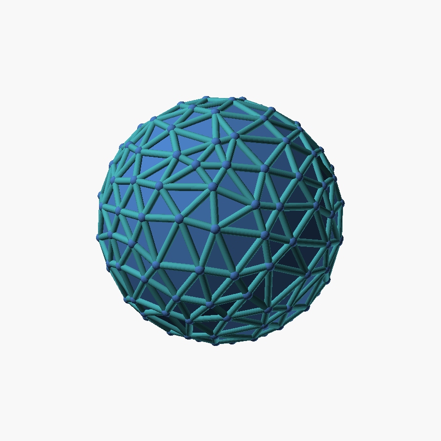

# Teufelsberg geodesic sphere

An irregular **geodesic triangulated sphere** in the pattern of the triangular
radome domes at the former listening station on
[Teufelsberg](https://en.wikipedia.org/wiki/Teufelsberg) in Berlin.

- The surface is **filled triangular panels** (a closed faceted shell) — the
  space bounded by the triangles is filled, so the sphere is **opaque**, not
  see-through.
- On top runs a **raised round frame**: a strut along every edge with a hub at
  every node, like the real dome's structural frame (the "bortik").
- The triangulation is a subdivided icosahedron with **jittered vertices**, so
  triangle size/shape **vary** across the surface (less regular than a uniform
  grid), keeping the pentagon-node / hexagon-flower structure of a real dome.



## Files

- `generate_triangulated.py` — computes the mesh and emits `geosphere.scad`.
- `geosphere.scad` — **generated**; edit the generator, not this file.
- `generate_goldberg.py` — alternative *hexagonal* (Goldberg) variant, matching
  the tall spherical radome instead of the triangular ones.
- `render.sh`, `renders/`, `stl/` — preview + printable STL.

## Parameters

Pattern is set when generating:

```bash
python3 generate_triangulated.py 4 0.35 > geosphere.scad
#                                 |    |
#                            freq |    | jitter (irregularity, 0 = perfect grid)
```

- `freq` 3–6: geodesic frequency (higher = more, smaller triangles).
- `jitter`: how irregular the triangles are (≈0.25 subtle … 0.5 wild).

Live parameters at the top of `geosphere.scad`:

| name | meaning |
|------|---------|
| `R` | sphere radius (mm) |
| `rim` | strut radius → raised border thickness |
| `node` | hub radius at each vertex (set `= rim` to drop distinct hubs) |
| `strut_fn` | strut/hub roundness (segments); higher = rounder |
| `fill` | `true` = filled opaque panels; `false` = hollow see-through cage |

## Rendering engine — IMPORTANT (Manifold vs CGAL)

This model unions ~640 rounded solids (a strut + hub per edge/node). The old
**CGAL** backend in system OpenSCAD (2021.01) is *extremely* slow at this:
**7–12 minutes** per render, and it gets worse as `strut_fn` (roundness) goes up.

The **Manifold** backend (OpenSCAD 2023+) does the exact same booleans in
**~2–4 seconds**. Same geometry, ~100× faster. This is the difference between an
unusable and an instant live-preview loop — always use Manifold for this model.

System `openscad` here is 2021.01 (CGAL only, no `--backend` flag). A newer
build is installed locally so we get Manifold:

- Binary: `~/.local/opt/openscad-nightly/usr/bin/openscad` (OpenSCAD 2026.07.01,
  extracted from the official AppImage at <https://files.openscad.org/snapshots/>).
- Wrapper that forces the fast backend: **`~/.local/bin/openscad-manifold`**
  (just runs the above with `--backend=manifold "$@"`).

Use it directly, e.g.:

```bash
openscad-manifold -o stl/geosphere.stl geosphere.scad     # ~4 s, Status: NoError
```

The live viewer is pointed at it via `OPENSCAD_BIN`:

```bash
cd ../live-viewer
MODEL_DIR=../teufelsberg-geosphere OPENSCAD_BIN=$HOME/.local/bin/openscad-manifold \
  node server.mjs        # renders each edit in ~4 s instead of minutes
```

To reinstall the engine if it's ever lost:

```bash
curl -O https://files.openscad.org/snapshots/OpenSCAD-2026.07.01-x86_64.AppImage
chmod +x OpenSCAD-2026.07.01-x86_64.AppImage
./OpenSCAD-2026.07.01-x86_64.AppImage --appimage-extract      # -> squashfs-root/
mkdir -p ~/.local/opt && cp -r squashfs-root ~/.local/opt/openscad-nightly
printf '#!/usr/bin/env bash\nexec %s/.local/opt/openscad-nightly/usr/bin/openscad --backend=manifold "$@"\n' "$HOME" \
  > ~/.local/bin/openscad-manifold && chmod +x ~/.local/bin/openscad-manifold
```

## Render

```bash
./render.sh      # uses openscad-manifold automatically when present
```
